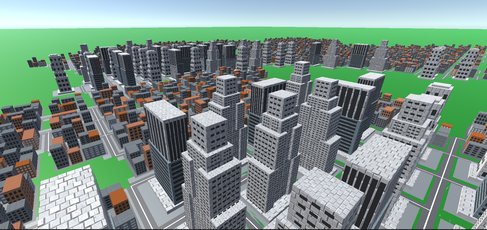
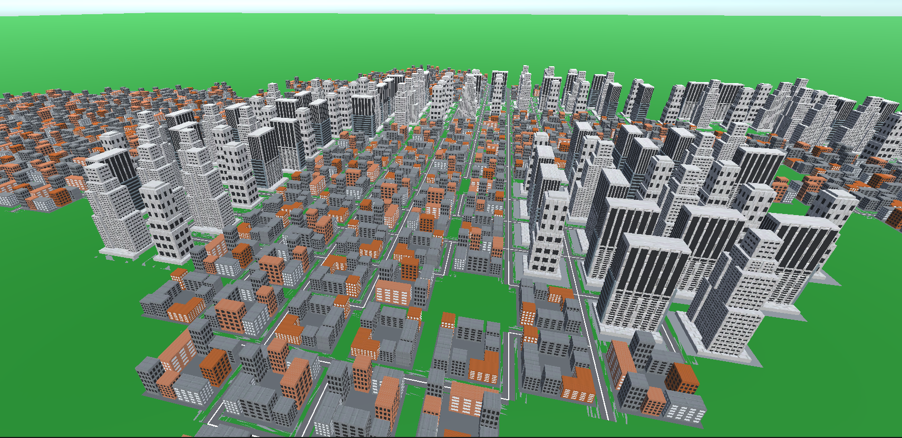
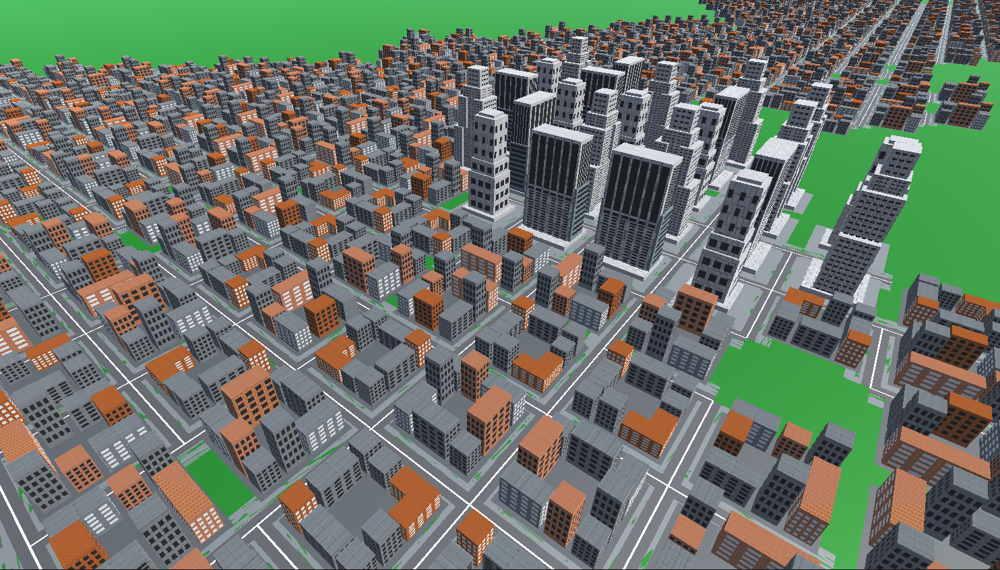
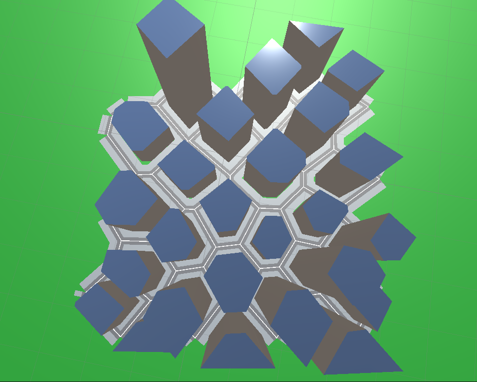
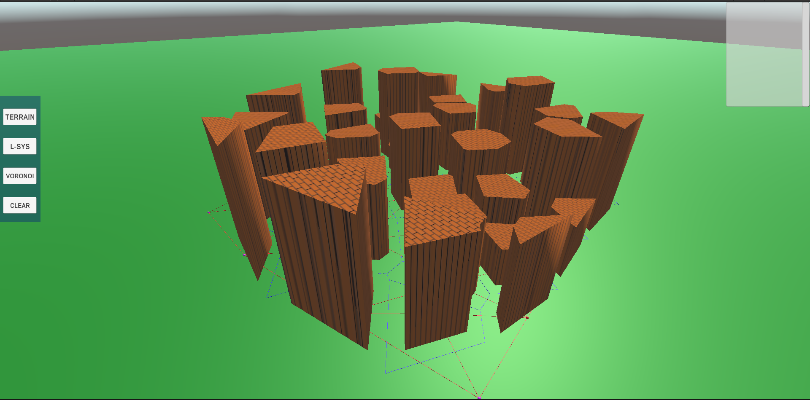
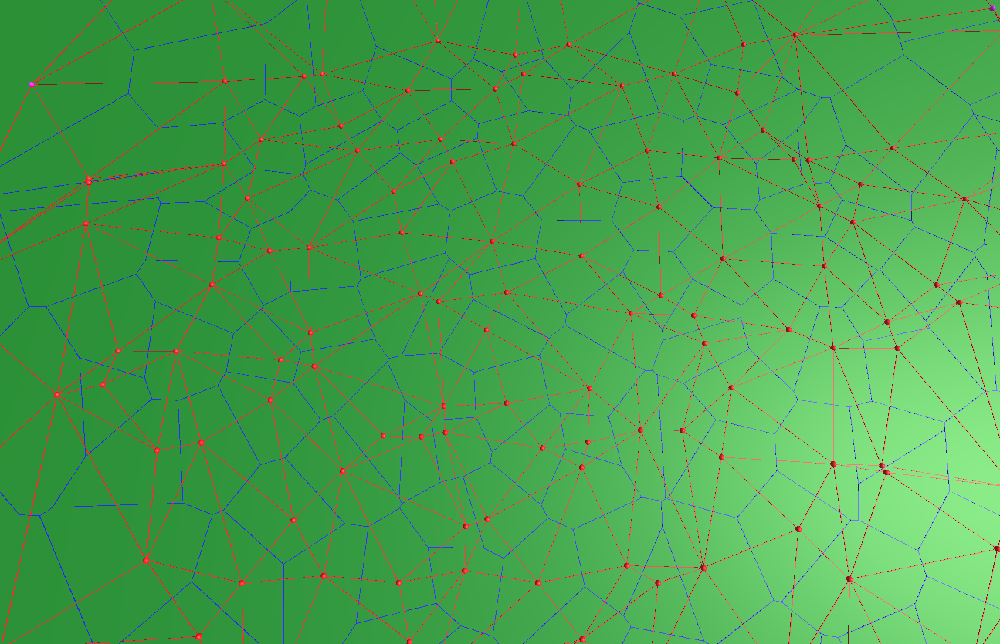

# Unity City Generator

Created by: Harry Alexander

## Description

This Unity project explores the application of L-systems and Voronoi diagrams in the procedural generation of virtual cities for games. Created in Unity version 2022.1.3. **WORK IN PROGRESS**

